<div align="center">

# Mokshayani Enterprise Assistant

**Intelligent Enterprise Assistant: Enhancing Organizational Efficiency through AI-driven Chatbot Integration**

Built for **Smart India Hackathon (SIH) 2024** | Problem Statement by **GAIL (India) Ltd**

<p>
  
  
  
  
  
  
  
</p>

<p>
  
  
  
  
  
</p>

An AI-powered chatbot that helps employees of large public sector organizations get instant answers about **HR policies**, **IT support**, **company events**, and more - with document processing, image OCR, 2FA security, and profanity filtering.

</div>

---

<details>
<summary><b>Table of Contents</b></summary>

- [Demo](#demo)
- [Features](#features)
- [Problem Statement](#problem-statement)
- [Architecture](#architecture)
- [Tech Stack](#tech-stack)
- [Getting Started](#getting-started)
- [API Reference](#api-reference)
- [Project Structure](#project-structure)
- [Screenshots](#screenshots)
- [Roadmap](#roadmap)
- [Team](#team)
- [License](#license)

</details>

---

## Demo

### Authentication & 2FA Flow

<p align="center">
  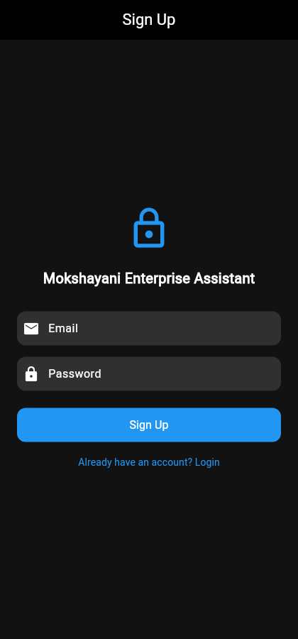
  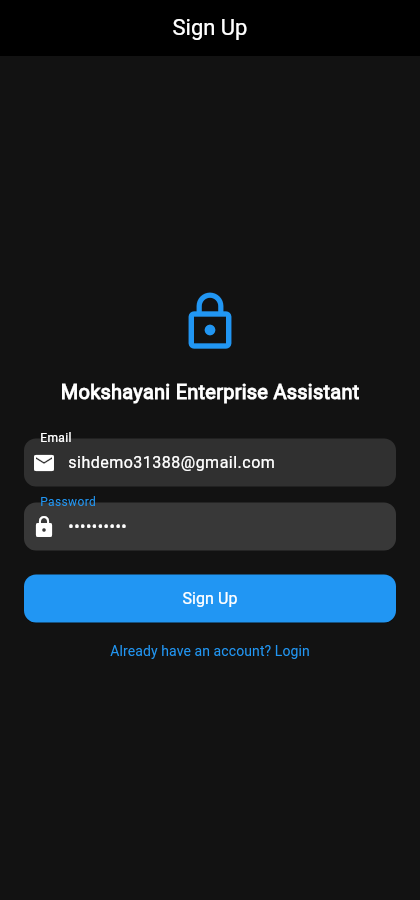
  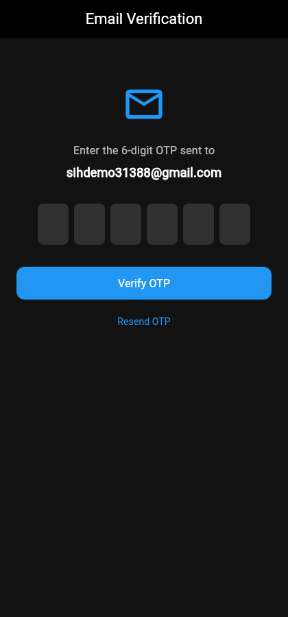
  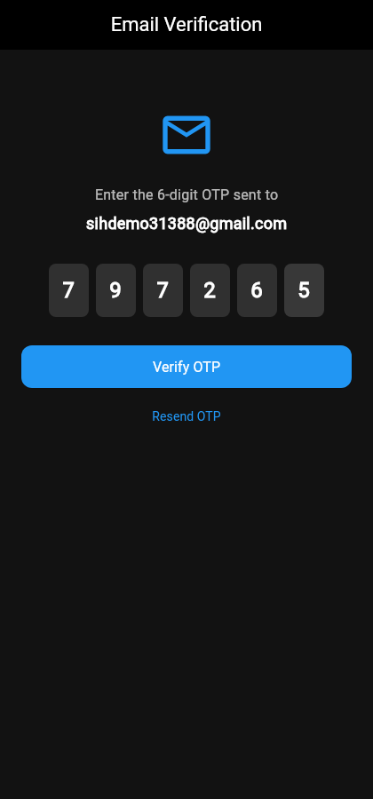
</p>

<p align="center">
  <i>Sign Up &rarr; Enter Credentials &rarr; Receive OTP (2FA) &rarr; Enter 6-digit OTP</i>
</p>

### AI Chatbot in Action

<p align="center">
  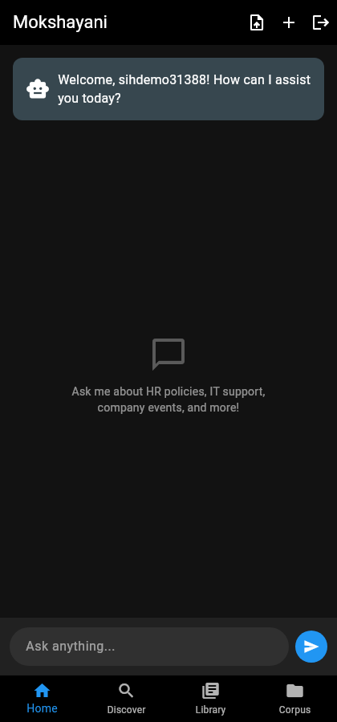
  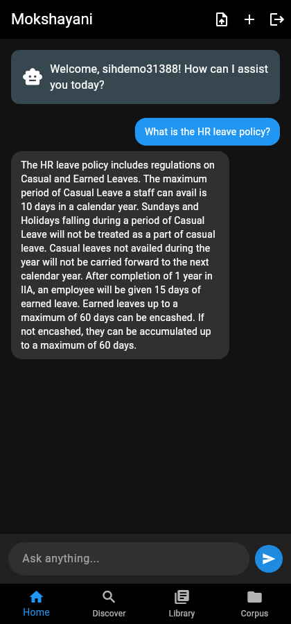
  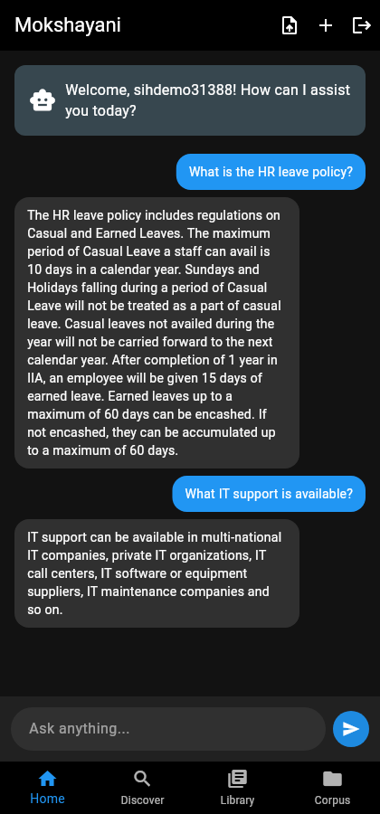
  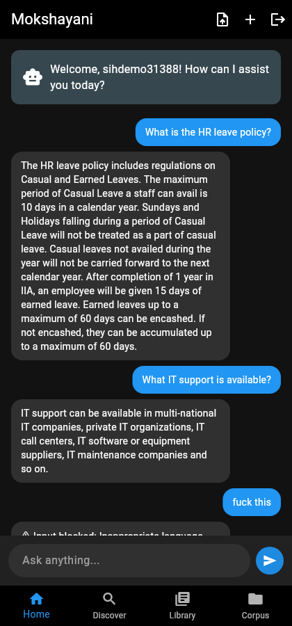
</p>

<p align="center">
  <i>Welcome Screen &rarr; HR Policy Answer (Confidence: 1.0) &rarr; Multi-turn Q&A &rarr; Profanity Blocked</i>
</p>

### Discover, Corpus & History

<p align="center">
  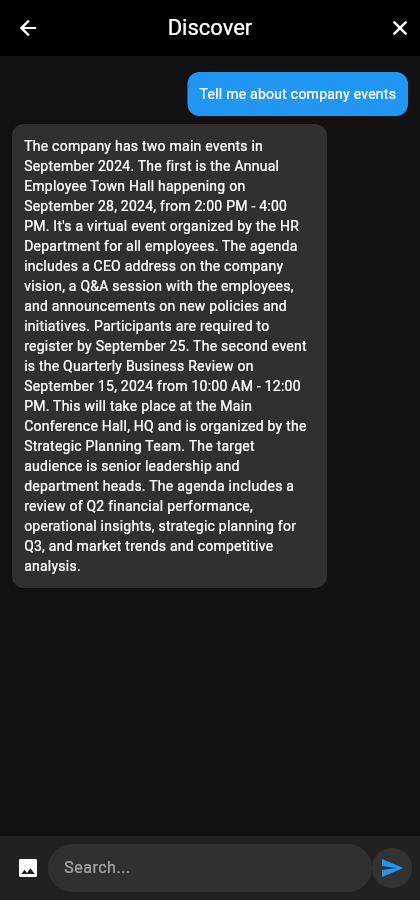
  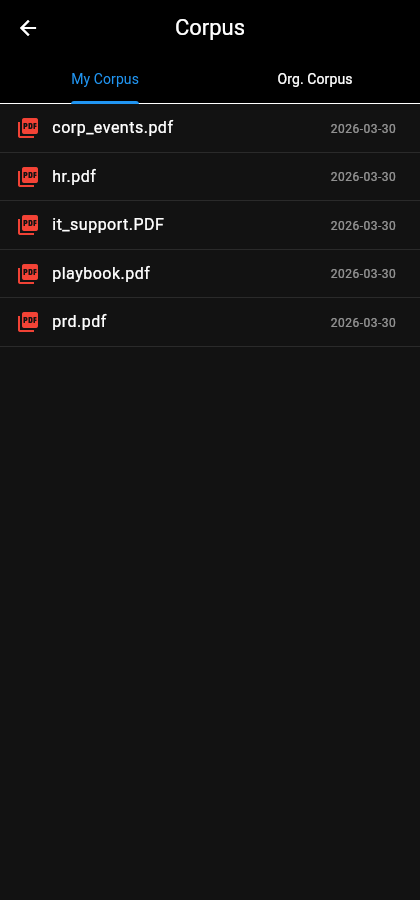
  
</p>

<p align="center">
  <i>Search & Document Analysis &rarr; PDF Corpus Management &rarr; Chat History</i>
</p>

---

## Features

| Feature | Description | Status |
|:--------|:------------|:------:|
| **AI Chatbot (RAG)** | Answers HR, IT, events queries using GPT-4 + corporate document context | Done |
| **Document Processing** | Upload PDFs - auto-chunked, embedded, and indexed in vector store | Done |
| **Image OCR** | Upload images for text extraction via GPT-4o Vision | Done |
| **2FA Authentication** | Firebase email/password + 6-digit email OTP verification | Done |
| **Bad Language Filter** | 73-word regex dictionary blocks profanity before AI processing | Done |
| **5+ Concurrent Users** | Threaded Flask backend handles parallel requests | Done |
| **< 5s Response Time** | Persistent ChromaDB vector store - built once, cached to disk | Done |
| **Chat History** | Local storage of conversation history with delete/clear | Done |
| **Corpus Management** | View uploaded documents (My Corpus + Org Corpus) | Done |

---

## Problem Statement

> **SIH 2024 - GAIL (India) Ltd**
>
> Develop a chatbot using deep learning and NLP to accurately understand and respond to queries from employees of a large public sector organization. The chatbot should handle HR policies, IT support, company events, and other organizational matters. It must include document processing capabilities, support 5+ concurrent users with < 5s response time, implement 2FA authentication, and filter bad language.

### Requirement Checklist

- [x] Chatbot for HR, IT, events queries (RAG with GPT-4)
- [x] Document processing - summarize & extract from uploaded PDFs
- [x] Scalable for 5+ concurrent users (threaded Flask)
- [x] Response time < 5 seconds (persistent vector store)
- [x] 2FA email-based authentication (Firebase + OTP)
- [x] Bad language filtering (73-word dictionary)
- [x] Free and open-source resources only

---

## Architecture

```
┌─────────────────────┐         ┌──────────────────────────────────┐
│   Flutter Frontend   │  HTTP   │         Flask Backend             │
│                      │ ◄─────► │                                  │
│  ┌───────────────┐  │         │  ┌────────┐    ┌──────────────┐  │
│  │  Auth Screen   │  │         │  │ /ask   │───►│   RAG Engine  │  │
│  │  (Firebase)    │  │         │  │        │    │  ┌─────────┐ │  │
│  └───────┬───────┘  │         │  └────────┘    │  │ ChromaDB│ │  │
│          ▼          │         │                 │  │(Vectors)│ │  │
│  ┌───────────────┐  │         │  ┌────────┐    │  └─────────┘ │  │
│  │  OTP Screen   │  │         │  │ /ocr   │───►│  ┌─────────┐ │  │
│  │  (2FA)        │  │         │  │        │    │  │ GPT-4   │ │  │
│  └───────┬───────┘  │         │  └────────┘    │  │ GPT-4o  │ │  │
│          ▼          │         │                 │  └─────────┘ │  │
│  ┌───────────────┐  │         │  ┌────────┐    └──────────────┘  │
│  │  Chat Screen   │  │         │  │/upload │                      │
│  │  Discover      │  │         │  │ _pdf   │    ┌──────────────┐  │
│  │  Library       │  │         │  └────────┘    │   MongoDB     │  │
│  │  Corpus        │  │         │                 │  (Images DB)  │  │
│  └───────────────┘  │         │  ┌────────┐    └──────────────┘  │
│                      │         │  │OTP Svc │                      │
│  Bottom Nav (4 tabs) │         │  │(SMTP)  │    ┌──────────────┐  │
└─────────────────────┘         │  └────────┘    │  Bad Words    │  │
                                │                 │  Filter (73)  │  │
                                └─────────────────┴──────────────┘  │
                                                                    │
                                 ┌──────────────────────────────────┘
                                 │  Corpus PDFs:
                                 │  hr.pdf, it_support.PDF,
                                 │  corp_events.pdf, prd.pdf,
                                 │  playbook.pdf
                                 └──────────────────────────────────
```

### How RAG Works

```
User Query ──► Bad Word Check ──► Embed Query (text-embedding-ada-002)
                                          │
                                          ▼
                                  ChromaDB Similarity Search (k=3)
                                          │
                                          ▼
                                  Context + Query ──► GPT-4
                                          │
                                          ▼
                                  JSON { answer, confidence }
                                          │
                              ┌────────────┴────────────┐
                              │                         │
                        confidence > 0.5          confidence ≤ 0.5
                              │                         │
                              ▼                         ▼
                        Return answer          Fallback: Image DB search
                                                        │
                                                        ▼
                                               "I don't have enough
                                                information..."
```

---

## Tech Stack

<table>
  <tr>
    <th>Layer</th>
    <th>Technology</th>
    <th>Purpose</th>
  </tr>
  <tr>
    <td rowspan="4"><b>Frontend</b></td>
    <td>Flutter 3.5+</td>
    <td>Cross-platform UI (Web, Android, iOS)</td>
  </tr>
  <tr>
    <td>Firebase Auth</td>
    <td>Email/password authentication</td>
  </tr>
  <tr>
    <td>SharedPreferences</td>
    <td>Local chat history storage</td>
  </tr>
  <tr>
    <td>HTTP + File Picker</td>
    <td>API calls, PDF/image upload</td>
  </tr>
  <tr>
    <td rowspan="5"><b>Backend</b></td>
    <td>Python Flask</td>
    <td>REST API server (threaded)</td>
  </tr>
  <tr>
    <td>OpenAI GPT-4 / GPT-4o</td>
    <td>Q&A generation, image OCR</td>
  </tr>
  <tr>
    <td>LangChain + ChromaDB</td>
    <td>RAG pipeline, vector embeddings</td>
  </tr>
  <tr>
    <td>MongoDB</td>
    <td>Image analysis storage</td>
  </tr>
  <tr>
    <td>smtplib (SMTP)</td>
    <td>Email OTP delivery for 2FA</td>
  </tr>
</table>

---

## Getting Started

### Prerequisites

- Python 3.10+
- Flutter SDK >= 3.5.1
- MongoDB (running locally)
- OpenAI API key ([get one here](https://platform.openai.com/api-keys))
- Firebase project ([setup guide](https://firebase.google.com/docs/flutter/setup))

### Backend Setup

```bash
cd backend

# 1. Configure environment
cp .env.example .env
# Edit .env - add your OPENAI_API_KEY (required)
# SMTP credentials are optional (OTP logged to console without them)

# 2. Install dependencies
pip install -r requirements.txt

# 3. Start the server
python app.py
# Server runs at http://localhost:8081
# First startup builds the vector store from corpus PDFs (~15s)
```

### Frontend Setup

```bash
# 1. Install Flutter dependencies
flutter pub get

# 2. Run on your preferred platform
flutter run -d chrome     # Web
flutter run -d android    # Android
flutter run -d ios        # iOS

# To change backend URL, edit lib/services/api_service.dart line 6
```

### Verify Everything Works

```bash
# Health check
curl http://localhost:8081/health
# → {"status": "ok"}

# Ask a question
curl -X POST http://localhost:8081/ask \
  -H "Content-Type: application/json" \
  -d '{"question": "What is the HR leave policy?"}'
# → {"response": "The HR leave policy includes...", "confidence": 1, "source": "corporate_documents"}

# Test bad language filter
curl -X POST http://localhost:8081/ask \
  -H "Content-Type: application/json" \
  -d '{"question": "fuck you"}'
# → {"error": "Input blocked: Inappropriate language detected!"} (HTTP 400)
```

---

## API Reference

| Endpoint | Method | Body | Description |
|:---------|:------:|:-----|:------------|
| `/health` | `GET` | - | Health check |
| `/ask` | `POST` | `{"question": "..."}` | Chat with AI (RAG). Returns `{response, confidence, source}` |
| `/ocr` | `POST` | `multipart/form-data` (file) | Image upload + OCR via GPT-4o Vision |
| `/upload_pdf` | `POST` | `multipart/form-data` (file) | Upload PDF to corpus, triggers re-indexing |
| `/corpus/user` | `GET` | - | List user-uploaded corpus files |
| `/corpus/org` | `GET` | - | List organization corpus files |
| `/send-otp` | `POST` | `{"email": "..."}` | Generate & send 6-digit OTP (5-min expiry) |
| `/verify-otp` | `POST` | `{"email": "...", "otp": "..."}` | Verify OTP. Returns `{verified: true/false}` |

---

## Project Structure

```
.
├── lib/                          # Flutter frontend
│   ├── main.dart                 # App entry point + routes
│   ├── firebase_options.dart     # Firebase config (auto-generated)
│   ├── screens/
│   │   ├── auth_screen.dart      # Login / Sign Up (Firebase)
│   │   ├── otp_screen.dart       # 6-digit OTP verification (2FA)
│   │   ├── chat_screen.dart      # Main chat interface
│   │   ├── discover_screen.dart  # Search + image/file upload
│   │   ├── library_screen.dart   # Chat history
│   │   └── corpus_screen.dart    # Document corpus (My + Org tabs)
│   └── services/
│       └── api_service.dart      # Centralized API client
│
├── backend/
│   ├── app.py                    # Flask server - all endpoints
│   ├── rag.py                    # RAG engine (LangChain + ChromaDB)
│   ├── bad_words.py              # 73-word profanity filter
│   ├── otp_service.py            # Email OTP generation & verification
│   ├── corpus/                   # Corporate PDF documents
│   │   ├── hr.pdf
│   │   ├── it_support.PDF
│   │   ├── corp_events.pdf
│   │   ├── prd.pdf
│   │   └── playbook.pdf
│   ├── requirements.txt
│   └── .env.example
│
├── pubspec.yaml                  # Flutter dependencies
├── screenshots/                  # App screenshots
└── README.md
```

---

## Screenshots

<details>
<summary><b>Click to expand all screenshots</b></summary>

### Authentication Flow

| Sign Up | Login | Credentials Filled |
|:-------:|:-----:|:---------:|
|  | 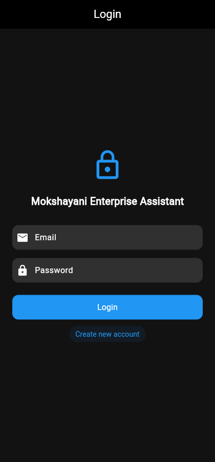 |  |

### 2FA - Email OTP Verification

| OTP Screen | OTP Entered | Verified → Home |
|:----------:|:-----------:|:---------------:|
|  |  |  |

### AI Chatbot - Real Conversations

| Typing Query | HR Policy Response | Multi-turn Q&A |
|:------------:|:------------------:|:--------------:|
| 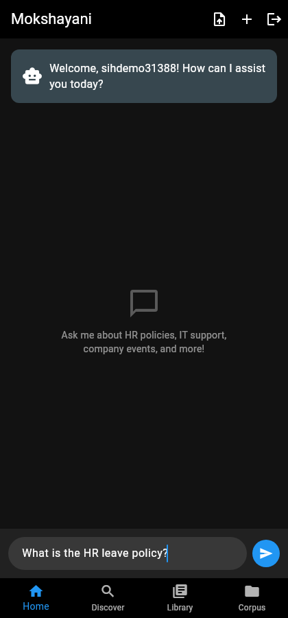 |  |  |

### Bad Language Filter & Discover

| Profanity Blocked | Discover Screen | Company Events Search |
|:-----------------:|:---------------:|:---------------------:|
|  | 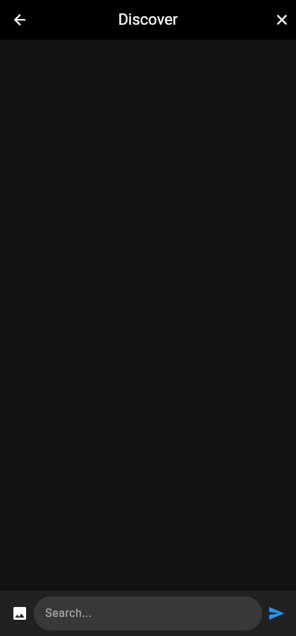 |  |

### Library & Corpus

| Chat History | Document Corpus |
|:------------:|:---------------:|
|  |  |

</details>

---

## Roadmap

- [x] RAG chatbot with corporate document Q&A
- [x] Firebase authentication (email/password)
- [x] 2FA with email OTP
- [x] Bad language filter (73-word dictionary)
- [x] Document upload & re-indexing
- [x] Image OCR via GPT-4o Vision
- [x] Persistent vector store (ChromaDB on disk)
- [x] Corpus management (My + Org)
- [x] Chat history with local storage
- [x] 5+ concurrent user support
- [ ] Push notifications for OTP
- [ ] Admin dashboard for corpus management
- [ ] Multi-language support (Hindi, regional)
- [ ] Voice input/output
- [ ] Analytics & usage tracking

---

## Team

Built by **Team Mokshayani** for Smart India Hackathon 2024.

---

## License

Distributed under the MIT License. See `LICENSE` for more information.

---

<div align="center">

**Built with OpenAI GPT-4, LangChain, ChromaDB, Flutter, and Firebase**

If this project helped you, consider giving it a star!

</div>
